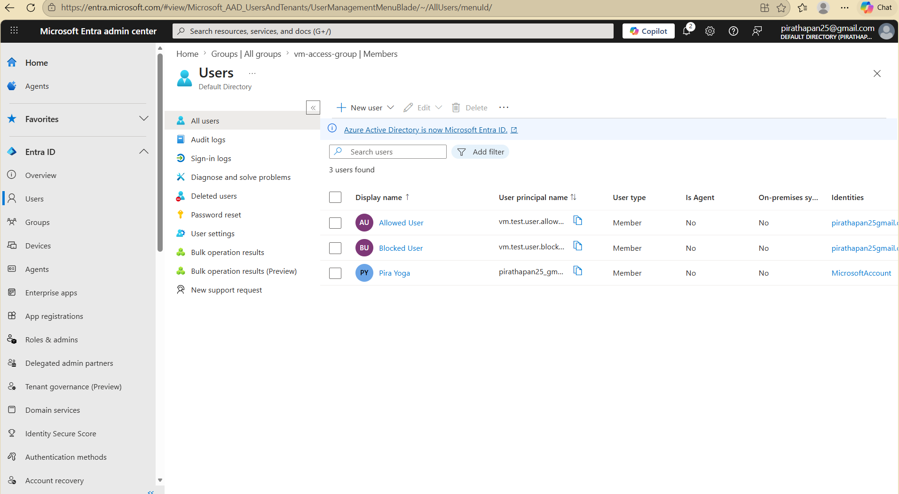
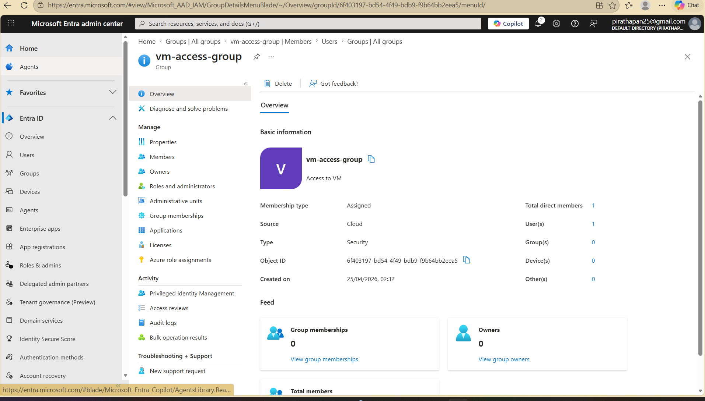
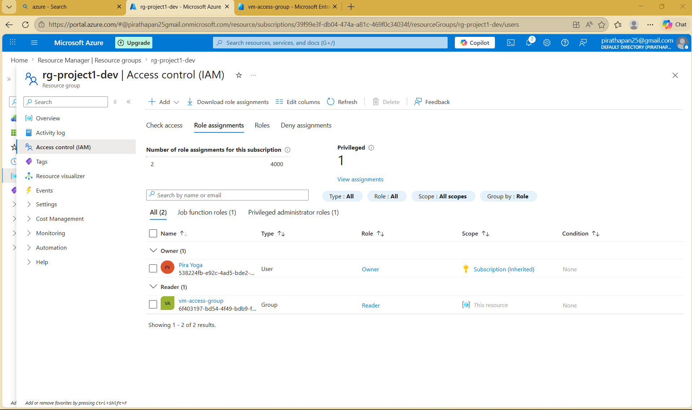
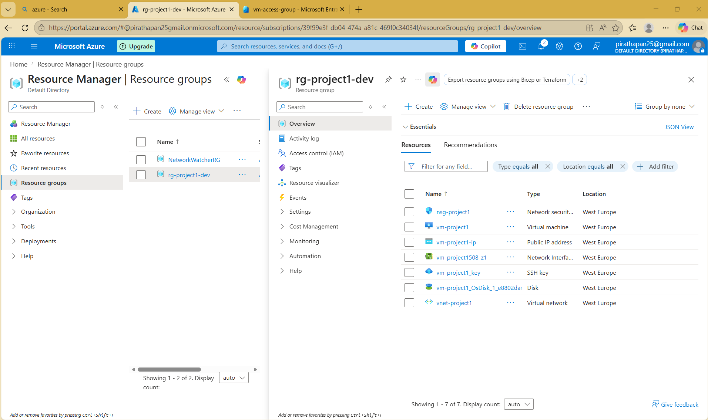
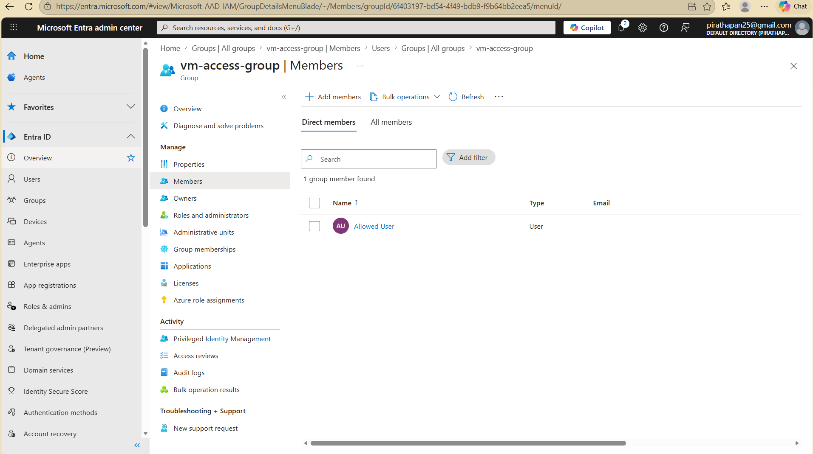
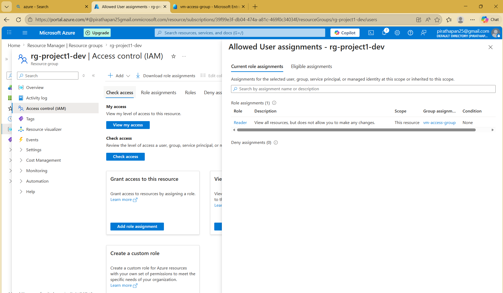
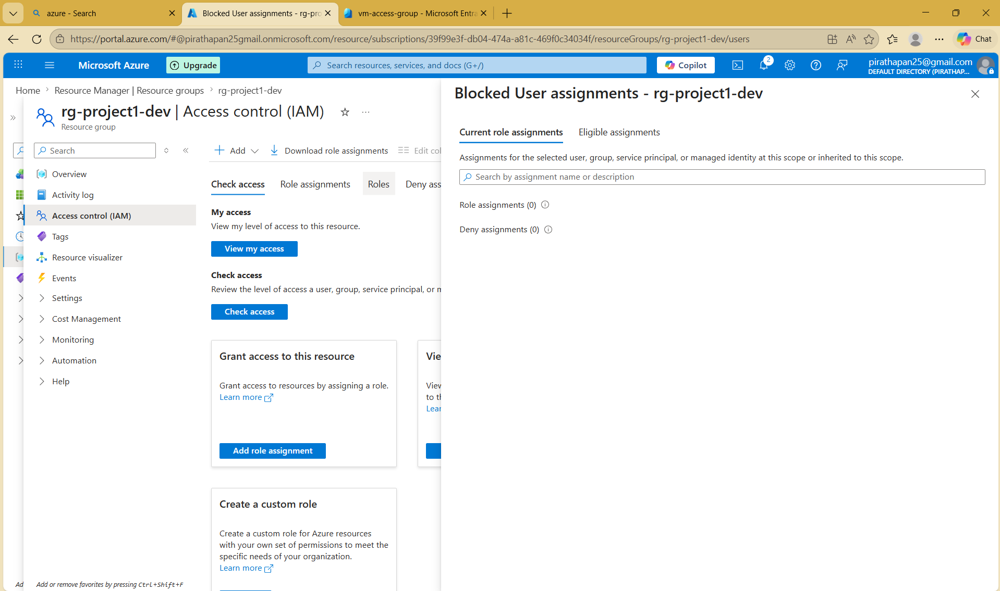

# 🔐 Azure Identity & Access Management (Entra ID + RBAC)

## 📌 Overview

This project demonstrates the implementation of identity and access management in Microsoft Azure using Microsoft Entra ID and Role-Based Access Control (RBAC).

The objective was to simulate a real-world cloud environment where access to Azure resources is controlled using identities, security groups, and role assignments following the principle of least privilege.

---

## 🎯 Objectives

- Create and manage user identities in Microsoft Entra ID
- Implement security groups for scalable access management
- Apply Role-Based Access Control (RBAC) at resource group level
- Enforce least-privilege access principles
- Demonstrate controlled vs restricted access scenarios

---

## 🏗️ Architecture
Users (Microsoft Entra ID)

↓

Security Group (vm-access-group)

↓

RBAC Role Assignment (Reader Role)

↓

Azure Resource Group (rg-project1-dev)

↓

Cloud Resources (VM, Networking, Web Server)

---

## 👤 Identity Configuration

Two user accounts were created to simulate real-world access control scenarios:

- **vm.user.allowed**
  - Assigned to security group
  - Granted access to Azure resources

- **vm.user.blocked**
  - Not assigned to any group
  - No access to protected resources

---

## 👥 Security Groups

A security group was created to manage access at scale:

- **Group Name:** vm-access-group  
- **Type:** Security Group  
- **Membership:** Assigned (manual control)  

The group contains authorized users and serves as the primary access control mechanism.

---

## 🔐 Role-Based Access Control (RBAC)

Access to Azure resources was controlled using RBAC:

- **Role Assigned:** Reader  
- **Scope:** Resource Group (`rg-project1-dev`)  
- **Assigned To:** vm-access-group  

This ensures users inherit permissions through group membership rather than individual assignments.

---

## 🧪 Access Control Validation

| User | Group Membership | Access Result |
|------|------------------|---------------|
| vm.user.allowed | Yes | ✅ Access Granted |
| vm.user.blocked | No | ❌ Access Denied |

This validates the principle of least privilege and confirms correct RBAC implementation.

---

## 🧠 Key Concepts Demonstrated

- Identity management using Microsoft Entra ID
- Group-based access control model
- Role-Based Access Control (RBAC)
- Least privilege security principle
- Separation of identity and permissions
- Scalable access management design

---

## 🔐 Security Principles Applied

- Least Privilege Access
- Role-Based Authorization
- Group-Based Identity Management
- Centralized Permission Control

---

## 📸 Screenshots

### 👤 Users in Microsoft Entra ID
Shows both user accounts created in the tenant.

---

### 👥 Security Group Configuration
Security group used to manage access centrally.

---

### 🔐 Role Assignments (RBAC)
Displays Reader role assigned to the security group at resource group level.

---

### 🏗️ Resource Group Overview
Azure resource group containing deployed infrastructure.

---

### 👥 Group Membership
Shows User 1 assigned to the security group.

---

### 🧪 Access Test — User 1 (Allowed)
User with group membership successfully accessing resources.

---

### 🚫 Access Test — User 2 (Denied)
User without group membership is denied access.

## 🚀 Outcome

This project successfully demonstrates how Azure identity and access management is structured in enterprise environments, ensuring secure and scalable access control across cloud resources.

---

## 👨‍💻 Author

Built as part of a cloud engineering learning path focusing on Microsoft Azure infrastructure, identity management, and cloud security fundamentals.
